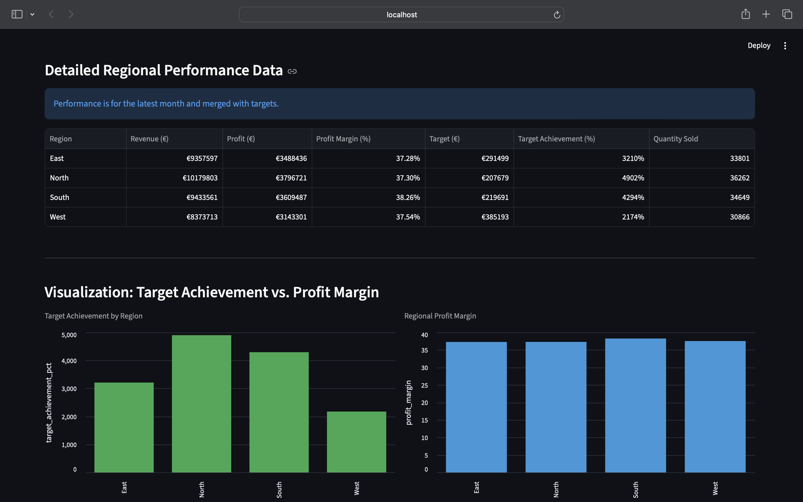
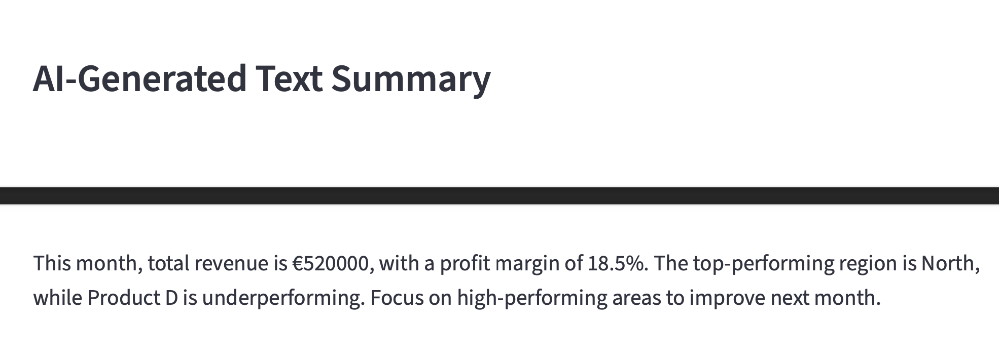
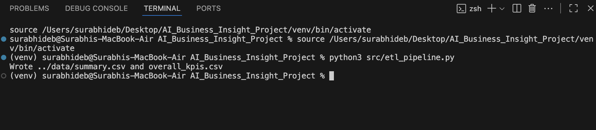

# AI Business Insight Generator

## Overview
This project is an **AI-powered business intelligence dashboard** built with **Python, SQL, and Streamlit**.  
It simulates real-world business data using synthetic generation (via Faker), automates ETL workflows, and provides key performance insights through dynamic visualizations and an AI-generated executive summary.

The goal was to replicate an end-to-end data analytics process — from **data extraction to business insight generation** — to demonstrate skills in data engineering, analytics, and automation.

---

## Features
- **ETL Pipeline**: Automated data generation, cleaning, and transformation using Python (Pandas, Faker).  
- **AI-Powered Summary**: NLP-based text generation summarizing key insights.  
- **Interactive Dashboard**: Streamlit interface showing KPIs, regional performance tables, and charts.  
- **Data Storage**: Output stored as CSV files for reproducibility and SQL integration.  
- **Scalable Design**: Can be extended to real business datasets or APIs.

---

## Tech Stack
| Category | Tools & Libraries |
|-----------|-------------------|
| Programming | Python |
| Data | Pandas, SQL |
| Visualization | Streamlit |
| AI / NLP | OpenAI (or placeholder) |
| Automation | Faker |
| Reporting | CSV, Power BI (optional extension) |

---

## How It Works
1. **Data Generation** – Faker library creates synthetic sales and performance data.  
2. **ETL Pipeline** – Data is cleaned, merged, and aggregated using Pandas.  
3. **AI Summary** – A short executive summary is generated from KPIs.  
4. **Dashboard Visualization** – Streamlit displays KPIs, charts, and summaries interactively.

---

## Project Structure
```
AI_Business_Insight_Project/
│
├── data/
│   ├── summary.csv
│   ├── overall_kpis.csv
│   └── insights.txt
│
├── src/
│   ├── etl_pipeline.py
│   └── dashboard_app.py
│
├── README.md
├── requirements.txt
└── venv/
```

---

## How to Run

### 1. Clone the repository
```bash
git clone https://github.com/yourusername/AI_Business_Insight_Project.git
cd AI_Business_Insight_Project
```

### 2. Set up your environment
```bash
python3 -m venv venv
source venv/bin/activate
pip install -r requirements.txt
```

### 3. Run the ETL pipeline
```bash
python src/etl_pipeline.py
```

### 4. Launch the dashboard
```bash
streamlit run src/dashboard_app.py
```

---

## 5. Sample Outputs

**Figure 1: Streamlit Dashboard Displaying KPIs**  
  

**Figure 2: AI-Generated Executive Summary**  
  

**Figure 3: ETL Pipeline Output**  
 

---

## Skills Demonstrated
- Python Programming  
- Data Engineering (ETL Pipelines)  
- SQL Integration  
- Data Modeling & Validation  
- Dashboard Design (Streamlit)  
- NLP & AI Text Generation  
- Automation  
- Business Intelligence  
- Reporting  

---

## Author
**Surabhi Deb**  
📍 France  
📧 [debsurabhi30@gmail.com](mailto:debsurabhi30@gmail.com)  
🔗 [LinkedIn Profile](https://www.linkedin.com/in/surabhi-deb-28ab90166)
